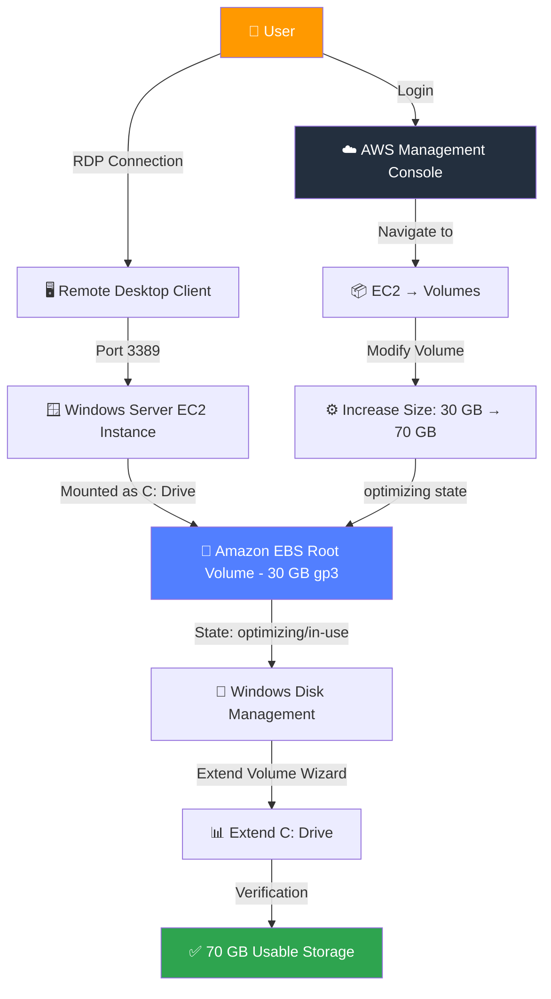
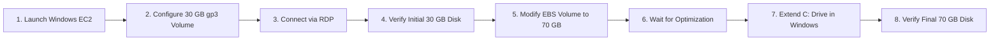

<div align="center">

# ☁️ AWS: Scaling Amazon EBS Storage on a Windows EC2 Instance

### Expanding a Windows Server root volume from 30 GB ➜ 70 GB with zero downtime and zero data loss

&nbsp;&nbsp;&nbsp;

<p>
A hands-on, end-to-end AWS Cloud Engineering lab that demonstrates how to safely scale Amazon EBS storage<br/>
on a live Windows Server EC2 instance — entirely online, with no reboot and no data risk.
</p>

[](https://aws.amazon.com/)
[](https://aws.amazon.com/ec2/)
[](https://aws.amazon.com/ebs/)
[](https://www.microsoft.com/windows-server)
[](https://aws.amazon.com/ebs/general-purpose/)
[]()
[]()
[]()
[]()
[](LICENSE)

</div>

---

## 📑 Table of Contents

1. [Project Overview](#-1-project-overview)
2. [Architecture Diagram](#-2-architecture-diagram)
3. [Project Objectives](#-3-project-objectives)
4. [Prerequisites](#-4-prerequisites)
5. [AWS Services Used](#-5-aws-services-used)
6. [Project Workflow](#-6-project-workflow)
7. [Step-by-Step Practical Guide](#-7-step-by-step-practical-guide)
8. [PowerShell Commands Reference](#-8-powershell-commands-reference)
9. [Before vs After Comparison](#-9-before-vs-after-comparison)
10. [Real-World Enterprise Use Cases](#-10-real-world-enterprise-use-cases)
11. [Advantages](#-11-advantages)
12. [Limitations](#-12-limitations)
13. [Best Practices](#-13-best-practices)
14. [Common Errors & Troubleshooting](#-14-common-errors--troubleshooting)
15. [Learning Outcomes](#-15-learning-outcomes)
16. [Key AWS Concepts Covered](#-16-key-aws-concepts-covered)
17. [Future Improvements](#-17-future-improvements)
18. [Screenshots](#-18-screenshots)
19. [Repository Structure](#-19-repository-structure)
20. [Conclusion](#-20-conclusion)
21. [Author](#-21-author)
22. [License](#-22-license)

---

## 🧭 1. Project Overview

### What is Amazon EBS?

**Amazon Elastic Block Store (EBS)** is a durable, high-performance block storage service designed for use with Amazon EC2. Think of it as a virtual hard drive that attaches to your cloud server — except it's network-attached, automatically replicated within its Availability Zone, and can be resized, snapshotted, and re-attached independently of the instance's lifecycle.

Every EC2 instance needs at least one EBS volume to act as its **root volume** — the drive that holds the operating system (in this case, Windows Server) and, by default, the `C:` drive.

### Why does EBS resizing matter?

In traditional on-premises infrastructure, increasing disk capacity usually means:

- Physically swapping or adding hard drives
- Taking the server offline
- Rebuilding RAID arrays
- Migrating data manually

With Amazon EBS, none of that is required. You can **increase volume size, change volume type, or adjust IOPS/throughput — live, with the instance running** — using a feature called **Elastic Volumes**.

> 💡 **Key Insight:** EBS resizing is *online* and *non-destructive*. The instance keeps running, the data stays intact, and the only manual step left is telling the operating system to use the newly available space.

### Common Enterprise Use Cases

| Scenario | Why EBS Scaling Helps |
|---|---|
| 📈 **Unexpected storage growth** | Logs, backups, or user data outgrow the original estimate |
| 🗄️ **Database servers** | Data volumes grow continuously and can't tolerate downtime |
| 🧾 **Compliance & log retention** | Regulatory requirements increase retention windows, increasing storage needs |
| 🏗️ **Application servers** | New features or caching layers consume more disk |
| 🔄 **Disaster recovery rebuilds** | Restored environments may need larger volumes than the original |

### Benefits of Scaling Storage Without Rebuilding Servers

- ✅ **Zero downtime** — no instance stop/start required
- ✅ **Zero data loss** — existing data is preserved automatically
- ✅ **Zero re-provisioning** — no need to migrate to a new instance
- ✅ **Cost-efficient** — pay only for the additional GB you provision
- ✅ **Operationally simple** — a console click plus a native OS step

This project walks through that entire process, end-to-end, on a real Windows Server EC2 instance.

---

## 🏗️ 2. Architecture Diagram



**Flow summary:** The user connects to AWS, modifies the EBS volume size from the console, and then completes the process from inside the Windows OS by extending the partition — all without disconnecting the RDP session or rebooting the instance.

---

## 🎯 3. Project Objectives

By completing this project, you will be able to:

- [x] Launch and configure a Windows Server EC2 instance from scratch
- [x] Understand the relationship between EC2 instances and EBS volumes
- [x] Modify a live EBS volume's size using the AWS Console
- [x] Understand the EBS "Elastic Volumes" modification lifecycle (`modifying` → `optimizing` → `complete`)
- [x] Extend a Windows NTFS partition using Disk Management (GUI) and `diskpart`/PowerShell (CLI)
- [x] Verify storage changes both in AWS and inside the guest OS
- [x] Apply AWS best practices around snapshots, tagging, and cost control
- [x] Troubleshoot common volume-expansion issues

---

## ✅ 4. Prerequisites

| # | Requirement | Details |
|---|---|---|
| 1 | 🔑 **AWS Account** | An active AWS account (Free Tier eligible for this lab) |
| 2 | 👤 **IAM User** | An IAM user/role with `AmazonEC2FullAccess` (or scoped EC2 + EBS permissions) — avoid using the root account |
| 3 | 🧠 **EC2 Knowledge** | Basic familiarity with launching and connecting to EC2 instances |
| 4 | 🪟 **Windows Basics** | Comfortable navigating Windows Server (Disk Management, File Explorer) |
| 5 | 🖥️ **Remote Desktop Client** | RDP client installed (built into Windows; "Microsoft Remote Desktop" on macOS) |
| 6 | 🌐 **Internet Connection** | Stable connection for console access and the RDP session |
| 7 | 💳 **Billing Awareness** | Understanding that EC2 + EBS usage incurs cost beyond Free Tier limits |

---

## 🧩 5. AWS Services Used

| Service | Purpose in This Project | Required? |
|---|---|---|
| **Amazon EC2** | Hosts the Windows Server instance | ✅ Required |
| **Amazon EBS** | Provides the resizable root volume (gp3) | ✅ Required |
| **IAM** | Controls who can launch/modify EC2 & EBS resources | ✅ Required |
| **Security Groups** | Firewall rules controlling RDP (3389) access | ✅ Required |
| **Remote Desktop Protocol (RDP)** | Remote GUI access into the Windows instance | ✅ Required |
| **Elastic IP** | Optional static public IP for the instance | ⚪ Optional |
| **Amazon CloudWatch** | Optional monitoring of disk metrics post-expansion | ⚪ Optional |

---

## 🔄 6. Project Workflow



| Step | Action | Where It Happens |
|---|---|---|
| 1 | Launch a Windows Server 2022 EC2 instance | AWS Console |
| 2 | Attach a 30 GB gp3 root volume | AWS Console (Launch Wizard) |
| 3 | Connect to the instance via RDP | Local machine |
| 4 | Confirm the OS sees a 30 GB `C:` drive | Windows Disk Management |
| 5 | Modify the EBS volume size to 70 GB | AWS Console → EC2 → Volumes |
| 6 | Wait for the volume state to return to `completed`/`in-use` (`optimizing` in background) | AWS Console |
| 7 | Extend the `C:` partition to claim the new space | Windows Disk Management / diskpart |
| 8 | Confirm `C:` now shows ~70 GB | Windows Disk Management / PowerShell |

---

## 🛠️ 7. Step-by-Step Practical Guide

> ⚠️ **Cost Note:** Running a `t3.medium` instance and a 70 GB gp3 volume falls outside the AWS Free Tier (which covers 30 GB of EBS and `t2.micro`/`t3.micro` usage). Terminate resources after the lab to avoid ongoing charges.

### 🔹 Step 1 — Log in to the AWS Management Console

**Purpose:** Establish an authenticated session to provision resources.
**Explanation:** Sign in using an IAM user (not root) with EC2 permissions.
**Best Practice:** Enable MFA on your IAM user before doing any console work.
**Expected Result:** You land on the AWS Console homepage with your region selected (top-right).

`📸 Screenshot Placeholder: /images/01-launch-instance.png`

---

### 🔹 Step 2 — Search for and Open the EC2 Service

**Purpose:** Navigate to the compute service where instances are managed.
**Explanation:** Use the top search bar and type "EC2," then select **EC2 — Virtual Servers in the Cloud**.
**Best Practice:** Pin EC2 to your console favorites for faster access in future sessions.
**Expected Result:** The EC2 Dashboard loads, showing resource summaries for the selected region.

---

### 🔹 Step 3 — Launch a New Instance

**Purpose:** Begin provisioning the Windows Server VM.
**Explanation:** Click **Launch Instance** from the EC2 Dashboard.
**Best Practice:** Name your instance descriptively, e.g. `win-ebs-scaling-lab`.
**Expected Result:** The "Launch an instance" wizard opens.

---

### 🔹 Step 4 — Select the Windows Server 2022 AMI

**Purpose:** Choose the operating system image for the instance.
**Explanation:** Under **Application and OS Images**, search for and select **Microsoft Windows Server 2022 Base**.
**Best Practice:** Use the latest patched AMI version available rather than an older cached one.
**Expected Result:** The AMI is highlighted as selected, showing it's Free-Tier eligible (instance hours, not storage beyond 30 GB).

> ⚠️ **Note:** Windows AMIs are **not** part of the EBS Free Tier storage allowance in the same way Linux AMIs sometimes are — always check current Free Tier terms.

---

### 🔹 Step 5 — Choose the Instance Type (t3.medium)

**Purpose:** Allocate sufficient CPU/RAM for a responsive Windows GUI session.
**Explanation:** Select **t3.medium** (2 vCPU, 4 GiB RAM) — Windows Server is resource-heavier than Linux and t2/t3.micro often feels sluggish over RDP.
**Best Practice:** For learning labs, t3.medium balances cost and usability; downgrade to t3.micro only for very short tests.
**Expected Result:** Instance type shows as selected with its hourly on-demand pricing visible.

---

### 🔹 Step 6 — Create or Select a Key Pair

**Purpose:** Generate the credentials needed to decrypt the Windows Administrator password.
**Explanation:** Click **Create new key pair**, name it (e.g. `win-ebs-lab-key`), choose **RSA** and **.pem** (or `.ppk` for PuTTY-based tools), then download it.
**Best Practice:** Store the `.pem` file securely — it cannot be re-downloaded. Never commit it to GitHub.
**Expected Result:** The key pair file downloads to your local machine.

> 🚫 **Warning:** Losing this key means you cannot retrieve the Administrator password for this instance through the standard method.

---

### 🔹 Step 7 — Configure the Security Group

**Purpose:** Control inbound network access to the instance.
**Explanation:** Create a new security group allowing **RDP (TCP/3389)** from **My IP** only.
**Best Practice:** Never open RDP to `0.0.0.0/0` (the entire internet) — this is a major attack vector for brute-force login attempts.
**Expected Result:** A security group rule appears: `RDP | TCP | 3389 | My IP`.

| Type | Protocol | Port Range | Source | Purpose |
|---|---|---|---|---|
| RDP | TCP | 3389 | My IP | Secure remote administration |

---

### 🔹 Step 8 — Configure Storage (30 GB gp3 Root Volume)

**Purpose:** Define the initial root volume size and type.
**Explanation:** Under **Configure Storage**, set the root volume to **30 GB**, type **gp3** (General Purpose SSD v3).
**Best Practice:** gp3 decouples IOPS/throughput from size, making it cheaper and more flexible than gp2 for most workloads.
**Expected Result:** Storage section shows `30 GiB — gp3 — Root volume`.

`📸 Screenshot Placeholder: /images/02-storage.png`

---

### 🔹 Step 9 — Launch the Instance

**Purpose:** Provision and boot the EC2 instance.
**Explanation:** Review the summary panel, then click **Launch Instance**.
**Best Practice:** Double-check region, AMI, instance type, and security group before launching to avoid unwanted cost.
**Expected Result:** A success banner appears with a link to view the new instance.

---

### 🔹 Step 10 — Wait for Status Checks to Pass

**Purpose:** Ensure the instance has fully booted and is network-reachable.
**Explanation:** On the Instances page, wait until **Status Check** shows **2/2 checks passed**.
**Best Practice:** Windows instances typically take longer to initialize than Linux — expect 4–8 minutes.
**Expected Result:** Instance state = `running`, Status Check = `2/2 checks passed`.

---

### 🔹 Step 11 — Decrypt the Administrator Password

**Purpose:** Retrieve login credentials for RDP.
**Explanation:** Right-click the instance → **Get Windows Password** → upload/paste the `.pem` key contents → click **Decrypt Password**.
**Best Practice:** Copy the password immediately and store it in a password manager — it won't be shown again automatically.
**Expected Result:** A decrypted Administrator password is displayed.

`📸 Screenshot Placeholder: /images/03-ebs-volume.png`

---

### 🔹 Step 12 — Connect via Remote Desktop

**Purpose:** Establish a graphical session into the Windows instance.
**Explanation:** Click **Connect → RDP Client**, download the `.rdp` file, open it, and enter the Administrator credentials.
**Best Practice:** If using the default RDP client, accept the certificate warning only if you trust the instance's public IP/DNS.
**Expected Result:** The Windows Server desktop loads successfully.

> ⚠️ **Troubleshooting Tip:** If the connection times out, double-check the security group allows your current public IP — IPs change between networks.

---

### 🔹 Step 13 — Open Disk Management and Verify Initial Size

**Purpose:** Confirm the OS recognizes the 30 GB root volume.
**Explanation:** Right-click **Start → Disk Management** (or run `diskmgmt.msc`). Confirm `C:` shows approximately **30 GB** (actual usable space is slightly less due to NTFS/system overhead).
**Best Practice:** Always verify the *before* state — this gives you a clean baseline for comparison.
**Expected Result:** Disk 0 shows one partition, `C:`, sized ~27.9–30 GB.

`📸 Screenshot Placeholder: /images/05-disk-management-before.png`

---

### 🔹 Step 14 — Navigate to EBS Volumes in the AWS Console

**Purpose:** Locate the EBS volume backing this instance.
**Explanation:** Go to **EC2 → Elastic Block Store → Volumes**. Find the volume attached to your instance (matches Instance ID).
**Best Practice:** Use the search/filter bar by Instance ID to avoid modifying the wrong volume in multi-instance accounts.
**Expected Result:** The 30 GB gp3 volume is listed with state `in-use`.

---

### 🔹 Step 15 — Modify the Volume

**Purpose:** Initiate the resize operation.
**Explanation:** Select the volume → **Actions → Modify Volume**.
**Best Practice:** Take an EBS snapshot before modifying production volumes — this lab is low-risk, but it's the correct real-world habit.
**Expected Result:** The "Modify Volume" dialog opens showing current size (30 GiB) and type (gp3).

`📸 Screenshot Placeholder: /images/04-modify-volume.png`

---

### 🔹 Step 16 — Increase Size to 70 GB

**Purpose:** Provision the additional capacity.
**Explanation:** In the size field, change `30` to `70`, leave type as gp3, click **Modify** → confirm in the dialog.
**Best Practice:** Size EBS volumes for projected 12-month growth to avoid repeated modification cycles (each volume has a 6-hour cooldown between modifications of the same type in some scenarios).
**Expected Result:** Volume state changes to `modifying`.

> ℹ️ **Note:** AWS enforces a minimum **6-hour wait** before you can submit another size-modification request on the same volume, even though the modification itself often completes in minutes.

---

### 🔹 Step 17 — Wait for the Modification to Complete

**Purpose:** Allow AWS to provision the new capacity.
**Explanation:** Volume state transitions: `modifying` → `optimizing` → `completed`. The volume remains usable throughout.
**Best Practice:** You don't need to wait for `optimizing` to fully finish before proceeding to the OS-level extension — `state: in-use` with size already showing 70 GiB is sufficient.
**Expected Result:** The **Size** column in the Volumes console now reads `70`.

---

### 🔹 Step 18 — Refresh Disk Management in Windows

**Purpose:** Make Windows re-scan the disk to detect the new raw space.
**Explanation:** Back in the RDP session, open Disk Management, right-click the disk area → **Rescan Disks** (or simply reopen Disk Management).
**Best Practice:** If the new space doesn't appear immediately, wait a minute and rescan again — propagation can take a short while.
**Expected Result:** Disk 0 now shows **30 GB allocated (C:) + 40 GB Unallocated space**.

---

### 🔹 Step 19 — Extend the C: Drive

**Purpose:** Merge the unallocated space into the existing `C:` partition.
**Explanation:** Right-click the `C:` volume → **Extend Volume** → follow the wizard, accepting the default (maximum available size) → **Finish**.
**Best Practice:** Only extend into *adjacent, unallocated* space — Extend Volume cannot skip over other partitions.
**Expected Result:** `C:` partition now spans the full 70 GB, with no unallocated space remaining.

`📸 Screenshot Placeholder: /images/06-extend-volume.png`

---

### 🔹 Step 20 — Verify the Final 70 GB Size

**Purpose:** Confirm the operation succeeded end-to-end.
**Explanation:** Check **This PC** in File Explorer, or Disk Management, or run a PowerShell verification command (see next section).
**Best Practice:** Always verify from at least two angles (GUI + CLI) in production scenarios.
**Expected Result:** `C:` drive shows approximately **70 GB total capacity**.

`📸 Screenshot Placeholder: /images/07-after-70gb.png`

---

## 💻 8. PowerShell Commands Reference

These commands help verify and manage disks directly from the Windows command line — useful for automation or headless verification.

```powershell
# List all physical disks attached to the system
Get-Disk
```
**Explanation:** Shows disk number, friendly name, partition style (GPT/MBR), operational status, and total size. Use this to confirm the OS sees the disk at its new 70 GB size.

```powershell
# List all partitions across all disks
Get-Partition
```
**Explanation:** Displays partition number, drive letter, type, and size for every partition. Confirms whether `C:` has actually claimed the new space or if it's still sitting unallocated.

```powershell
# List all formatted volumes with drive letters and free space
Get-Volume
```
**Explanation:** Shows `DriveLetter`, `FileSystemLabel`, `Size`, and `SizeRemaining`. The fastest one-liner to confirm `C:` now reports ~70 GB total.

```powershell
# Resize partition 2 on disk 0 to use all remaining free space
$disk = Get-Partition -DriveLetter C
Resize-Partition -DiskNumber $disk.DiskNumber -PartitionNumber $disk.PartitionNumber -Size (Get-PartitionSupportedSize -DiskNumber $disk.DiskNumber -PartitionNumber $disk.PartitionNumber).SizeMax
```
**Explanation:** A scriptable PowerShell-native alternative to the Disk Management GUI's "Extend Volume" wizard — useful for automating this lab via script or Systems Manager Run Command.

```diskpart
REM Legacy CLI alternative using diskpart
diskpart
list disk
select disk 0
list partition
select partition 2
extend
```
**Explanation:** `diskpart` is the older, interactive disk-management CLI built into Windows. `extend` grows the selected partition into any immediately following unallocated space — functionally equivalent to the GUI wizard.

> 💡 All of the above commands are read/verify-safe except `Resize-Partition` and `diskpart extend`, which modify the partition table — always confirm you've selected the correct disk/partition number first.

---

## ⚖️ 9. Before vs After Comparison

### Storage Capacity

| Metric | Before (Initial State) | After (Scaled State) |
|---|---|---|
| **EBS Volume Size** | 30 GB | 70 GB |
| **Volume Type** | gp3 | gp3 (unchanged) |
| **C: Drive Total Size (OS-visible)** | ~27.9 GB | ~65.1 GB |
| **Unallocated Space** | 0 GB | 0 GB (after extension) |
| **Downtime Required** | — | None |
| **Data Loss Risk** | — | None |
| **Instance Reboot Required** | — | No |

### Cost Impact (Illustrative, On-Demand gp3 Pricing)

| Item | Before | After |
|---|---|---|
| Storage Provisioned | 30 GB | 70 GB |
| Relative Monthly Storage Cost | 1x baseline | ~2.33x baseline |
| IOPS / Throughput (gp3 baseline) | Included (3,000 IOPS / 125 MB/s) | Included (same baseline; scalable independently) |

> 💡 Actual pricing varies by region — always check the [AWS EBS Pricing Page](https://aws.amazon.com/ebs/pricing/) for current rates.

### Key Difference Explained

The jump from 30 GB to 70 GB happens in **two distinct layers**:

1. **AWS layer (the physical/virtual block device):** Resized instantly via the API/Console — AWS expands the underlying volume.
2. **OS layer (the NTFS partition):** Windows still sees the *old* partition boundary until you explicitly extend it — this is why Step 18–19 in the practical guide were necessary. AWS resizing the volume does **not** automatically resize the filesystem inside it.

---

## 🏢 10. Real-World Enterprise Use Cases

| Use Case | Scenario | How EBS Scaling Helps |
|---|---|---|
| 🖥️ **Production Web Server** | Application logs accumulate faster than projected | Increase volume size live, no maintenance window required |
| 🗄️ **Database Storage** | A SQL Server or PostgreSQL data directory approaches capacity | Resize volume online, extend partition, avoid emergency downtime |
| 🧰 **Application Server** | New microservice or cache layer needs local disk space | Scale storage without re-architecting the deployment |
| 📁 **File Server** | Shared drives fill up faster than expected due to org growth | Expand storage in minutes instead of procuring new hardware |
| 🔁 **Disaster Recovery** | A DR environment is restored from snapshot but undersized | Resize the restored volume to match or exceed production specs |
| ☁️ **Cloud Migration** | An on-prem server is "lifted and shifted" with conservative initial sizing | Right-size after migration based on real observed usage |
| 📈 **Business Growth** | A startup's data needs outpace its original infrastructure plan | Scale incrementally instead of over-provisioning up front |

---

## ✅ 11. Advantages

- **🟢 Zero-downtime scaling** — no instance stop/start, no reboot
- **🟢 Data-safe by design** — Elastic Volumes never deletes or rewrites existing data
- **🟢 Granular control** — resize by exact GB, independent of instance type
- **🟢 Independent scaling of size, type, and performance** — gp3 lets you tune IOPS/throughput separately from capacity
- **🟢 Pay-as-you-grow economics** — no need to over-provision "just in case"
- **🟢 Fully API/CLI/IaC automatable** — works identically via Console, CLI, SDKs, Terraform, or CloudFormation
- **🟢 Reduced operational risk** — eliminates the need for manual data migration between volumes

---

## ⚠️ 12. Limitations

| Limitation | Detail |
|---|---|
| 🚫 **Cannot shrink EBS volumes** | AWS only supports increasing volume size, never decreasing it directly — shrinking requires creating a new smaller volume and migrating data |
| 🔧 **OS partition must be manually extended** | Resizing the EBS volume does not automatically resize the filesystem — an OS-level step is always required |
| 💰 **Cost increases with size** | Larger volumes cost more per month, regardless of actual data usage |
| 📸 **Snapshots strongly recommended** | While modifications are low-risk, AWS and best practice both recommend snapshotting before changes to production volumes |
| ⏱️ **Cooldown between modifications** | A minimum wait period applies before the same volume can be modified again |
| 🧩 **Partition layout constraints** | "Extend Volume" only works into immediately adjacent unallocated space — complex partition layouts may need additional tools |

---

## 🛡️ 13. Best Practices

1. 📸 **Always create a snapshot before modifying a production EBS volume**
2. 🏷️ **Tag every resource** (Name, Environment, Owner) for cost tracking and governance
3. 🔐 **Apply IAM least privilege** — grant only the EC2/EBS permissions actually needed
4. 🧱 **Use gp3 over gp2** for better price-performance and independent IOPS/throughput tuning
5. 🔒 **Restrict RDP access to specific IPs**, never `0.0.0.0/0`
6. 🛑 **Enable Termination Protection** on long-lived or production instances
7. 📊 **Monitor disk metrics with Amazon CloudWatch** (`VolumeReadBytes`, `VolumeWriteBytes`, `DiskQueueDepth`)
8. 🔑 **Rotate and secure key pairs**, never commit `.pem`/`.ppk` files to version control
9. 🧹 **Avoid deleting volumes accidentally** — enable "Delete on Termination" deliberately, not by default assumption
10. 🔄 **Right-size before you resize** — review CloudWatch usage trends before increasing capacity
11. 🔐 **Encrypt EBS volumes at rest** using AWS KMS-managed or customer-managed keys
12. 🧾 **Document every infrastructure change** (this README is itself an example of that discipline)
13. 🧰 **Automate repeatable tasks** with AWS CLI, PowerShell, or Infrastructure-as-Code instead of manual console clicks
14. 💰 **Set up AWS Budgets/Billing Alarms** to catch unexpected storage cost growth early
15. 🧪 **Test in a non-production environment first**, exactly as this lab demonstrates
16. 🔁 **Patch and update the Windows AMI regularly** to avoid security drift
17. 🗑️ **Clean up lab resources promptly** after testing to avoid idle billing

---

## 🐞 14. Common Errors & Troubleshooting

| Error / Symptom | Likely Cause | Resolution |
|---|---|---|
| **Volume not visible in Console** | Wrong AWS Region selected | Confirm the region selector (top-right) matches the instance's launch region |
| **Disk still shows 30 GB after modification** | Windows hasn't rescanned the disk | Open Disk Management → right-click → **Rescan Disks**, or reopen the snap-in |
| **"Extend Volume" option greyed out** | No adjacent unallocated space, or volume is dynamic/foreign | Verify unallocated space sits *immediately after* the `C:` partition; rescan disks first |
| **RDP connection times out** | Security Group blocks your current public IP | Edit the Security Group inbound rule to allow RDP (3389) from your current IP |
| **"Network error" / Security Group issue** | Port 3389 not open, or NACL blocking traffic | Confirm Security Group + Network ACL both allow inbound/outbound RDP traffic |
| **Password decryption failed** | Wrong `.pem` key pasted, or password not yet generated | Wait a few minutes after launch; ensure you upload the exact key pair used at launch |
| **Volume modification stuck in "optimizing"** | Normal background process (not actually blocking) | This is expected — the volume remains usable; no action needed, just wait |
| **"You can't modify volume—pending modification"** | Cooldown window not yet elapsed from a prior modification | Wait for the 6-hour cooldown to pass before submitting another size change |
| **Access Denied in Console** | IAM user lacks EC2/EBS permissions | Attach an appropriate IAM policy (e.g., scoped `ec2:ModifyVolume`, `ec2:DescribeVolumes`) |

---

## 🎓 15. Learning Outcomes

After completing this lab, you will have hands-on experience with:

- Provisioning a Windows Server EC2 instance from the AWS Console
- Configuring Security Groups for secure remote access
- Understanding the EC2 ↔ EBS relationship at both the AWS and OS level
- Performing a live, non-destructive volume expansion using Elastic Volumes
- Extending an NTFS partition using both GUI (Disk Management) and CLI (PowerShell/diskpart) methods
- Verifying infrastructure changes from multiple vantage points
- Applying AWS Well-Architected best practices around storage, security, and cost

---

## 📘 16. Key AWS Concepts Covered

| Concept | Summary |
|---|---|
| **Amazon EC2** | Resizable virtual compute instances in the cloud |
| **Amazon EBS** | Persistent, network-attached block storage for EC2 |
| **gp3 Volume Type** | General Purpose SSD with independently configurable IOPS/throughput |
| **Root Volume** | The EBS volume containing the OS — analogous to a physical boot disk |
| **Elastic Volumes / Volume Expansion** | AWS feature enabling live resizing of EBS volumes |
| **Partition Extension** | The OS-level step of claiming newly available raw disk space |
| **Remote Desktop Protocol (RDP)** | Microsoft's protocol for graphical remote administration |
| **Windows Server** | Microsoft's server operating system, used here as the EC2 guest OS |

---

## 🚀 17. Future Improvements

- 🤖 **Automate the entire workflow with PowerShell**, including volume modification via AWS Tools for PowerShell
- ⌨️ **Script the lab end-to-end using AWS CLI** (`aws ec2 modify-volume`, etc.)
- 🏗️ **Recreate this lab as Infrastructure-as-Code** using **Terraform** or **AWS CloudFormation**
- 💽 **Experiment with additional EBS volumes** (non-root data disks) instead of only the root volume
- 🧱 **Explore RAID configurations** (e.g., Storage Spaces) across multiple EBS volumes for performance/redundancy
- 📸 **Integrate Amazon Data Lifecycle Manager** to automate snapshot scheduling
- 📊 **Add CloudWatch dashboards/alarms** for proactive disk-usage monitoring
- 🔁 **Build a "shrink" companion lab** demonstrating volume migration since EBS can't shrink natively

---

## 🖼️ 18. Screenshots

> Replace these placeholders with your own captured screenshots as you complete each step.

| Step | Screenshot |
|---|---|
| Launching the Instance | `/images/01-launch-instance.png` |
| Configuring 30 GB Storage | `/images/02-storage.png` |
| Viewing the EBS Volume | `/images/03-ebs-volume.png` |
| Modify Volume Dialog | `/images/04-modify-volume.png` |
| Disk Management — Before (30 GB) | `/images/05-disk-management-before.png` |
| Extend Volume Wizard | `/images/06-extend-volume.png` |
| Disk Management — After (70 GB) | `/images/07-after-70gb.png` |

---

## 📂 19. Repository Structure

```text
aws-ec2-ebs-storage-scaling/
│
├── README.md                # This file
├── images/                  # Screenshots referenced throughout the README
│   ├── 01-launch-instance.png
│   ├── 02-storage.png
│   ├── 03-ebs-volume.png
│   ├── 04-modify-volume.png
│   ├── 05-disk-management-before.png
│   ├── 06-extend-volume.png
│   └── 07-after-70gb.png
├── architecture/             # Diagrams and architecture source files
│   └── architecture-diagram.mmd
├── scripts/                  # Optional PowerShell / CLI automation scripts
│   └── extend-volume.ps1
└── LICENSE                   # MIT License
```

---

## 🏁 20. Conclusion

This project demonstrates a foundational, high-value AWS cloud engineering skill: **scaling persistent storage on a live production-style server with zero downtime and zero data loss.** While the steps may look simple in hindsight, they reflect a workflow used constantly in real enterprise environments — from database servers running low on space to file servers absorbing unplanned data growth.

By walking through both the **AWS Console layer** (modifying the EBS volume) and the **operating-system layer** (extending the Windows partition), this lab reinforces a critical mental model every cloud engineer needs: *cloud infrastructure and guest operating systems are two separate layers that must each be explicitly managed.*

---

## 👤 21. Author

<div align="center">

### Dhairya Panchal

**Cloud & DevOps Enthusiast** · **RHCSA Certified** · **AWS Learner**

📌 Passionate about cloud infrastructure, Linux administration, and building real-world hands-on labs that bridge the gap between theory and production-grade practice.

</div>

---

## 📜 22. License

This project is licensed under the **MIT License** — see the [LICENSE](LICENSE) file for full details.

```
MIT License

Copyright (c) 2026 Dhairya Panchal

Permission is hereby granted, free of charge, to any person obtaining a copy
of this software and associated documentation files (the "Software"), to deal
in the Software without restriction, including without limitation the rights
to use, copy, modify, merge, publish, distribute, sublicense, and/or sell
copies of the Software, subject to the following conditions:

The above copyright notice and this permission notice shall be included in
all copies or substantial portions of the Software.

THE SOFTWARE IS PROVIDED "AS IS", WITHOUT WARRANTY OF ANY KIND, EXPRESS OR
IMPLIED, INCLUDING BUT NOT LIMITED TO THE WARRANTIES OF MERCHANTABILITY,
FITNESS FOR A PARTICULAR PURPOSE AND NONINFRINGEMENT.
```

---

<div align="center">

⭐ **If this project helped you understand AWS storage scaling, consider giving it a star!** ⭐

</div>
